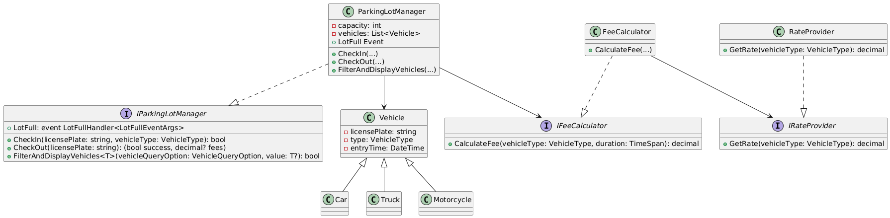

# Smart Parking Lot System 🚗

A modular and maintainable Smart Parking Lot Management System built with clean architecture principles in C#. The system supports various vehicle types, dynamic pricing strategies, notifications, and a user-friendly console interface.

## ✨ Features

- Vehicle check-in/check-out with fee calculation
- Vehicle filtering and querying by various criteria
- Dynamic fee calculation based on vehicle type
- Event-driven notification when lot is full
- Console-based UI with structured menus
- Input validation and structured error handling
- Clean architecture implementation
- Support for multiple vehicle types (cars, trucks, motorcycles)

## 🧱 Project Structure

```plaintext

docs/
│  └── uml/
│       └── parkinglot_uml.png
SmartParkingLot/
│
├── Program.cs
│
├── Core/
│   ├── Factories/
│   │   └── VehicleFactory/
│   ├── Services/
│   │   ├── ConsoleNotification.cs
│   │   ├── FeeCalculator.cs
│   │   ├── ParkingLotManager.cs
│   │   ├── RateProvider.cs
│   │   └── Interfaces/
│   │       ├── IFeeCalculator.cs
│   │       ├── INotifiable.cs
│   │       └── IParkingLotManager.cs
│   └── Validations/
│       └── VehicleValidator.cs
│
├── Domain/
│   ├── Enums/
│   │   ├── OperationType.cs
│   │   ├── VehicleQueryOption.cs
│   │   └── VehicleType.cs
│   ├── Events/
│   │   ├── Delegates.cs
│   │   └── LotFullEventArgs.cs
│   ├── Exceptions/
│   │   └── ParkingLotException.cs
│   ├── Interfaces/
│   │   └── IRateProvider.cs
│   └── Models/
│       ├── Vehicle.cs
│       ├── Car.cs
│       ├── Truck.cs
│       └── Motorcycle.cs
│
├── Presentation/
│   ├── Enums/
│   │   ├── MainMenuOptions.cs
│   │   └── VehicleQueryMenuOptions.cs
│   ├── Interfaces/
│   │   ├── IMainMenu.cs
│   │   ├── IMainMenuView.cs
│   │   ├── IVehicleQueryMenu.cs
│   │   └── IVehicleQueryView.cs
│   ├── Menus/
│   │   ├── MainMenu.cs
│   │   └── VehicleQueryMenu.cs
│   ├── Validations/
│   │   ├── InputValidator.cs
│   │   └── ValidationResult.cs
│   └── Views/
│       ├── MainMenuView.cs
│       └── VehicleQueryView.cs

```

## 📊 UML Diagram

Below is the UML class diagram demonstrating core system relationships:




## 🛠️ Technologies Used

- .NET / C#
- Object-Oriented Programming
- Event-driven Programming
- Console UI Design
- Custom Validation System
- Domain-Driven Design
- Clean Architecture


## 🚀 Getting Started

### Prerequisites
- .NET SDK (version 6.0 or higher)


### Installation

1. Clone the repository
```bash
git clone https://github.com/sabriNoor/Smart-Parking-Lot.git
```
2. Navigate to the project
```bash
cd Smart-Parking-Lot/SmartParkingLot
```
3. Build and run
```bash
dotnet run
```

## 📂 Contribution
Feel free to fork this repository and contribute by submitting a pull request.

